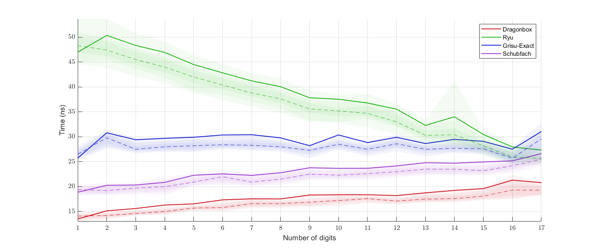
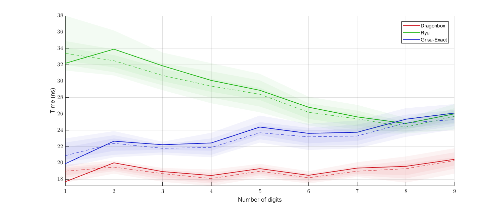
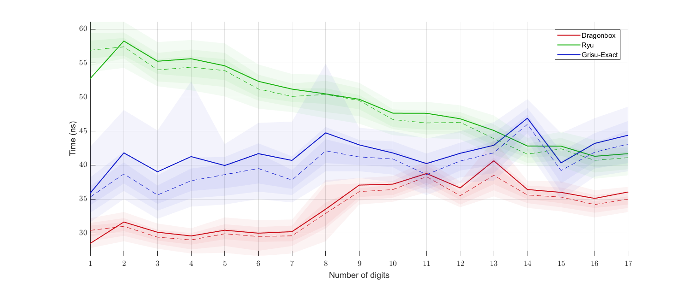
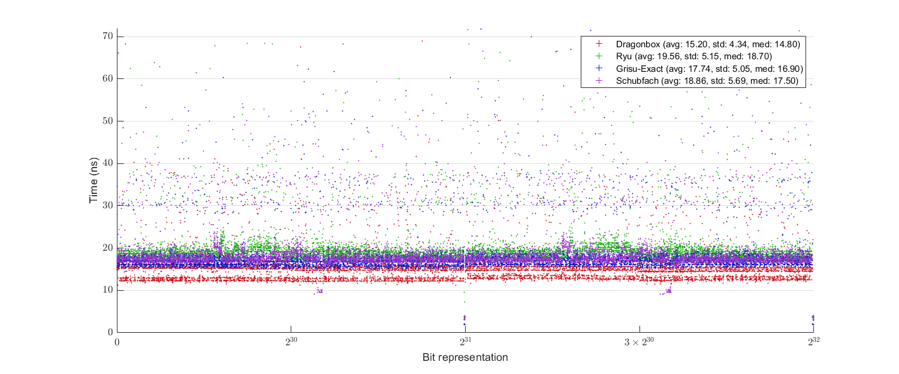
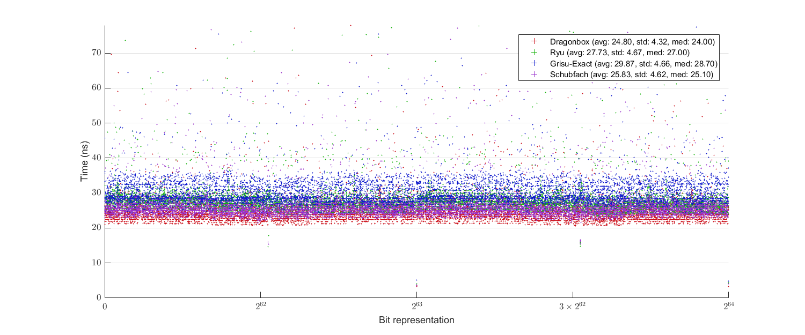
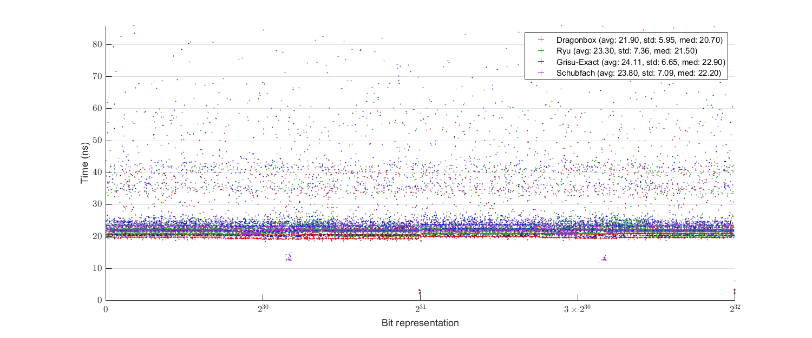
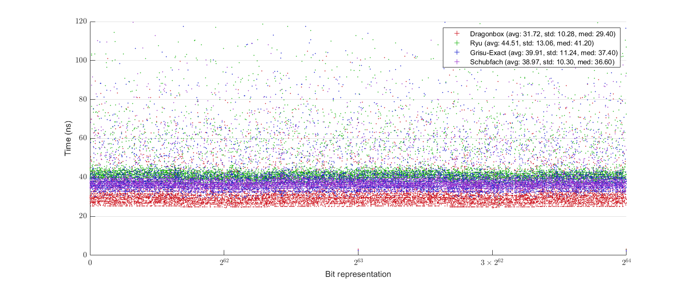
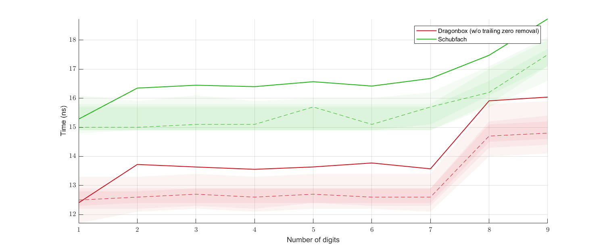

# Dragonbox
This library is a reference implementation of Dragonbox in C++.

Dragonbox is a float-to-string conversion algorithm based on a beautiful algorithm [Schubfach](https://drive.google.com/open?id=1luHhyQF9zKlM8yJ1nebU0OgVYhfC6CBN), developed by Raffaello Giulietti in 2017-2018. Dragonbox is further inspired by [Grisu](https://www.cs.tufts.edu/~nr/cs257/archive/florian-loitsch/printf.pdf) and [Grisu-Exact](https://github.com/jk-jeon/Grisu-Exact).

# Introduction
Dragonbox generates a pair of integers from a floating-point number: the decimal significand and the decimal exponent of the input floating-point number. These integers can then be used for string generation of decimal representation of the input floating-point number, the procedure commonly called ````ftoa```` or ````dtoa````.

The algorithm guarantees three things:

1) It has the roundtrip guarantee; that is, a correct parser interprets the generated output string as the original input floating-point number.

2) The output is of the shortest length; that is, no other output strings that are interpreted as the input number can contain less number of significand digits than the output of Dragonbox.

3) The output is correctly rounded: the number generated by Dragonbox is the closest to the actual value of the input number among possible outputs of minimum number of digits.

# About the Name "Dragonbox"
The core idea of Schubfach, which Dragonbox is based on, is a continuous analogue of discrete [pigeonhole principle](https://en.wikipedia.org/wiki/Pigeonhole_principle). The name *Schubfach* is coming from the German name of the pigeonhole principle, *Schubfachprinzip*, meaning "drawer principle". Since another name of the pigeonhole principle is *Dirichlet's box principle*, I decided to call my algorithm "Dragonbox" to honor its origins: Schubfach (box) and Grisu (dragon).

# How to Use
Although Drgonbox is intended for float-to-string conversion routines, the actual string generation is not officially a part of the algorithm. Dragonbox just outputs two integers (the decimal significand/exponent) that can be consumed by a string generation procedure. The header file [`dragonbox.h`](include/dragonbox/dragonbox.h) includes everything needed for this. It is header-only; you just need these two steps for using it:

1) Drop [`dragonbox.h`](include/dragonbox/dragonbox.h) in your include directory, and
2) `#include` it. That's it.

Nevertheless, a string generation procedure is included in the library. There are two additional files needed for that: [`dragonbox_to_chars.h`](include/dragonbox/dragonbox_to_chars.h) and [`dragonbox_to_chars.cpp`](source/dragonbox_to_chars.cpp) (the `.cpp` file is in the directory [`source`](source)). If you want to use them too, then:

1) In addition to [`dragonbox.h`](include/dragonbox/dragonbox.h), drop [`dragonbox_to_chars.h`](include/dragonbox/dragonbox_to_chars.h) in your include directory,
2) `#include` [`dragonbox_to_chars.h`](include/dragonbox/dragonbox_to_chars.h) instead of [`dragonbox.h`](include/dragonbox/dragonbox.h),
3) Build [`dragonbox_to_chars.cpp`](source/dragonbox_to_chars.cpp) as a library, and then
4) Link against it.

(Please be aware that [`dragonbox_to_chars.cpp`](source/dragonbox_to_chars.cpp) is expecting to have [`dragonbox_to_chars.h`](include/dragonbox/dragonbox_to_chars.h) in the parent directory of itself.)

However, note that features provided in [`dragonbox_to_chars.h`](include/dragonbox/dragonbox_to_chars.h)/[`.cpp`](source/dragonbox_to_chars.cpp) are quite limited and subject to change. Currently, there is no way to indicate any formatting options. Every float/double input is just printed as something like `-3.34E3`. No option for putting plus sign (+) in front of positive significands or positive exponents, no way to use `e` instead of `E`, no option for printing in a fixed-point form (like `-3340`), etc.. Also there is no way to precompute the minimum required size of buffer. I don't like this rigidity, and hope to add more customization features later. Yet, you can rather use `dragonbox.h` directly to implement your own string generation routine.

Besides these three, any other files are unncessary for real use.

A comprehensive reference for this library is in preparation.

# Language Standard
The library is targetting C++17 and actively using its features (e.g., `if constexpr`).

# Usage Examples
(Simple string generation from `float/double`)
```cpp
#include "dragonbox/dragonbox_to_chars.h"
double x = 1.234;  // Also works for float
char buffer[31];   // Should be long enough

// Null-terminate the buffer and return the pointer to the null character
// Hence, the length of the string is (end_ptr - buffer)
// buffer is now { '1', '.', '2', '3', '4', 'E', '0', '\0', (garbages) }
char* end_ptr = jkj::dragonbox::to_chars(x, buffer);

// Does not null-terminate the buffer; returns the next-to-end pointer
// buffer is now { '1', '.', '2', '3', '4', 'E', '0', (garbages) }
// you can wrap the buffer with things like std::string_view
end_ptr = jkj::dragonbox::to_chars_n(x, buffer);
```

(Direct use of `jkj::dragonbox::to_decimal`)
```cpp
#include "dragonbox/dragonbox.h"
double x = 1.234;   // Also works for float

// Here, x should be a nonzero finite number!
// The return value v is a struct with three members:
// significand : decimal significand (1234 in this case);
//               it is of type std::uint64_t for double, std::uint32_t for float
//    exponent : decimal exponent (-3 in this case); it is of type int
// is_negative : as the name suggests; it is of type bool
auto v = jkj::dragonbox::to_decimal(x);
```

By default, `jkj::dragonbox::to_decimal` returns a struct with three members (`significand`, `exponent`, and `is_negative`). But the return type and the return value can change if you specify policy paramters. See [below](https://github.com/jk-jeon/dragonbox#policies).

# Policies
Dragonbox provides several policies that the user can select. Most of the time the default policies will be sufficient, but for some situation this customizability might be useful. There are currently six different kinds of policies that you can specify: sign policy, trailing zero policy, rounding mode policy, correct rounding policy, cache policy, and input validation policy. Those policies are living in the namespace `jkj::dragonbox::policy`. You can provide the policies as additional parameters to `jkj::dragonbox::to_decimal` or `jkj::dragonbox::to_chars` or `jkj::dragonbox::to_chars_n`. Here is an example usage:
```cpp
#include "dragonbox/dragonbox.h"
auto v = jkj::dragonbox::to_decimal(x,
    jkj::dragonbox::policy::sign::ignore,
    jkj::dragonbox::policy::cache::compressed);
```
In this example, the `ignore` sign policy and the `compressed` cache policy are specified. The return value will not include the member `is_negative`, and `jkj::dragonbox::to_decimal` will internally use compressed cache for the computation. There is no particular order for policy parameter; you can give them in any order. Default policies will be chosen if you do not explicitly specify any. In the above example, for instance, `nearest_to_even` rounding mode policy is chosen, which is the default rounding mode policy. If you provide two or more policies of the same kind, or if you provide an invalid policy parameter, then the compliation will fail.

Policy parameters (e.g., `jkj::dragonbox::policy::sign::ignore` in the above example) are of different types, so different combinations of policies generally result in separate template instantiation, which might cause binary bloat. (However, it is only the combination that does matter; giving the same parameter combination in a different order will usually not generate a separate binary.)

## Sign policy
Determines whether or not if `jkj::dragonbox::to_decimal` will extract and return the sign of the input paramter.

- `jkj::dragonbox::policy::sign::ignore`: The sign of the input is ignored, and there is no `is_negative` member in the returned struct. It seems that this can improve the parameter passing overhead thus resulting in a faster string generation. Of course, you need to take care of the sign yourself. `jkj::dragonbox::to_chars` and `jkj::dragonbox::to_chars_n` use this policy internally.

- `jkj::dragonbox::policy::sign::return_sign`: **This is the default policy.** The sign of the input will be written in the `is_negative` member of the returned struct.

You cannot specify sign policy to `jkj::dragonbox::to_chars`/`jkj::dragonbox::to_chars_n`.

## Trailing zero policy
Determines what `jkj::dragonbox::to_decimal` will do with possible trailing decimal zeros.

- `jkj::dragonbox::policy::trailing_zero::ignore`: Do not care about trailing zeros; the output significand may contain trailing zeros.

- `jkj::dragonbox::policy::trailing_zero::remove`: **This is the default policy.** Remove all trailing zeros in the output.

- `jkj::dragonbox::policy::trailing_zero::report`: The output significand may contain trailing zeros, but such possibility will be reported in the additional member `may_have_trailing_zeros` of the returned struct. This member will be set to `true` if there might be trailing zeros, and it will be set to `false` if there should be no trailing zero.

You can also specify `jkj::dragonbox::policy::trailing_zero::ignore`/`jkj::dragonbox::policy::trailing_zero::remove` policies to `jkj::dragonbox::to_chars`/`jkj::dragonbox::to_chars_n`, but `jkj::dragonbox::policy::trailing_zero::report` cannot be used.

## Rounding mode policy
`jkj::dragonbox::to_decimal` provides various rounding modes. *Rounding mode* is the rule that determines the interval represented by a single bit pattern.

- `jkj::dragonbox::policy::rounding_mode::nearest_to_even`: **This is the default policy.** Use *round-to-nearest, tie-to-even* rounding mode.

- `jkj::dragonbox::policy::rounding_mode::nearest_to_odd`: Use *round-to-nearest, tie-to-odd* rounding mode.

- `jkj::dragonbox::policy::rounding_mode::nearest_toward_plus_infinity`: Use *round-to-nearest, tie-toward-plus-infinity* rounding mode.

- `jkj::dragonbox::policy::rounding_mode::nearest_toward_minus_infinity`: Use *round-to-nearest, tie-toward-minus-infinity* rounding mode.

- `jkj::dragonbox::policy::rounding_mode::nearest_toward_zero`: Use *round-to-nearest, tie-toward-zero* rounding mode. This will produce the fastest code among all *round-to-nearest* rounding modes.

- `jkj::dragonbox::policy::rounding_mode::nearest_away_from_zero`: Use *round-to-nearest, tie-away-from-zero* rounding mode.

- `jkj::dragonbox::policy::rounding_mode::nearest_to_even_static_boundary`: Use *round-to-nearest, tie-to-even* rounding mode, but there will be completely independent code paths for even inputs and odd inputs. This will produce a bigger binary, but might run faster than `jkj::dragonbox::policy::rounding_mode::nearest_to_even` for some situation.

- `jkj::dragonbox::policy::rounding_mode::nearest_to_odd_static_boundary`: Use *round-to-nearest, tie-to-odd* rounding mode, but there will be completely independent code paths for even inputs and odd inputs. This will produce a bigger binary, but might run faster than `jkj::dragonbox::policy::rounding_mode::nearest_to_odd` for some situation.

- `jkj::dragonbox::policy::rounding_mode::nearest_toward_plus_infinity_static_boundary`: Use *round-to-nearest, tie-toward-plus-infinity* rounding mode, but there will be completely independent code paths for positive inputs and negative inputs. This will produce a bigger binary, but might run faster than `jkj::dragonbox::policy::rounding_mode::nearest_toward_plus_infinity` for some situation.

- `jkj::dragonbox::policy::rounding_mode::nearest_toward_minus_infinity_static_boundary`: Use *round-to-nearest, tie-toward-plus-infinity* rounding mode, but there will be completely independent code paths for positive inputs and negative inputs. This will produce a bigger binary, but might run faster than `jkj::dragonbox::policy::rounding_mode::nearest_toward_minus_infinity` for some situation.

- `jkj::dragonbox::policy::rounding_mode::toward_plus_infinity`: Use *round-toward-plus-infinity* rounding mode.

- `jkj::dragonbox::policy::rounding_mode::toward_minus_infinity`: Use *round-toward-minus-infinity* rounding mode.

- `jkj::dragonbox::policy::rounding_mode::toward_zero`: Use *round-toward-zero* rounding mode.

- `jkj::dragonbox::policy::rounding_mode::away_from_zero`: Use *away-from-zero* rounding mode.

All of these policies can be specified also to `jkj::dragonbox::to_chars`/`jkj::dragonbox::to_chars_n`.

## Correct rounding policy
Determines what `jkj::dragonbox::to_decimal` will do when rounding tie occurs. This policy will be completely ignored if the specified rounding mode policy is not one of the round-to-nearest policies.

- `jkj::dragonbox::policy::correct_rounding::do_not_care`: Do not care about correct rounding at all and just find any shortest output with the correct roundtrip. It will produce a faster code, but the performance difference will not be big.

- `jkj::dragonbox::policy::correct_rounding::to_even`: **This is the default policy.** Choose the even number when rounding tie occurs.

- `jkj::dragonbox::policy::correct_rounding::to_odd`: Choose the odd number when rounding tie occurs.

- `jkj::dragonbox::policy::correct_rounding::away_from_zero`: Choose the number with the bigger absolute value when rounding tie occurs.

- `jkj::dragonbox::policy::correct_rounding::toward_zero`: Choose the number with the smaller absolute value when rounding tie occurs.

All of these policies can be specified also to `jkj::dragonbox::to_chars`/`jkj::dragonbox::to_chars_n`.

## Cache policy
Choose between the full cache table and the compressed one. Using the compressed cache will result in about 20% slower code, but it can significantly reduce the amount of required static data. It currently has no effect for binary32 (`float`) inputs. For binary64 (`double`) inputs, `jkj::dragonbox::cache_policy::normal` will cause `jkj::dragonbox::to_decimal` to use `24*16 + 619*16 = 10288` bytes of static data table, while the corresponding amount for `jkj::dragonbox::cache_policy::compressed` is `24*16 + 23*16 + 27*8 + 39*4 = 1124` bytes.

- `jkj::dragonbox::policy::cache::normal`: **This is the default policy.** Use the full table.

- `jkj::dragonbox::policy::cache::compressed`: Use the compressed table.

All of these policies can be specified also to `jkj::dragonbox::to_chars`/`jkj::dragonbox::to_chars_n`.

## Input validation policy
`jkj::dragonbox::to_decimal` only works with *finite* floating-point inputs. This policy determines what `jkj::dragonbox::to_decimal` will do with invalid inputs.

- `jkj::dragonbox::policy::input_validation::assert_finite`: **This is the default policy.** `assert` that the input is finite.

- `jkj::dragonbox::policy::input_validation::do_nothing`: Do nothing even if the input is not finite. It might be sometimes useful for debugging.

You cannot specify input validation policy to `jkj::dragonbox::to_chars`/`jkj::dragonbox::to_chars_n`.


# Performance
In my machine (Intel Core i7-7700HQ 2.80GHz, Windows 10), it defeats or is on par with other contemporary algorithms including Grisu-Exact and Ryu.

The following benchmark result is obtained using Milo's dtoa benchmark framework ([https://github.com/miloyip/dtoa-benchmark](https://github.com/miloyip/dtoa-benchmark)). The complete source code for the benchmark below is available [here](https://github.com/jk-jeon/dtoa-benchmark).


The red line at the bottom is the performance of Dragonbox with the full cache table, and the deep blue line above the purple line is the performance of Dragonbox with the compressed cache table.

There is also a benchmark done by myself (top: benchmark for ````float```` data, bottom: benchmark for ````double```` data; solid lines are the averages, dashed lines are the medians, and the shaded regions show 30%, 50%, and 70% percentiles):

(Clang)



(MSVC)



Here is another performance plot with uniformly randomly generated ````float````(top) or ````double````(bottom) data:

(Clang)



(MSVC)



Dragonbox seems to be also faster than Schubfach, but since the implementation of Schubfach I benchmarked against does not remove trailing decimal zeros, the version that does not care about trailing decimal zeros is used for the benchmarks below:

Digits benchmark (top: `float`, bottom: `double`):

(Clang)



(MSVC)


Uniform benchmark (top: `float`, bottom: `double`):

(Clang)


(MSVC)


# Comprehensive Explanation of the Algorithm
Please see [this](other_files/Dragonbox.pdf) paper.

# How to Run Tests
(Currently the project is undergoing transition into CMake. This section will be updated after finishing that.)
~~In order to run tests and benchmarks, you need `.cpp/.h` files in the directories [`subproject`](subproject), in addition to [`dragonbox.h`](include/dragonbox/dragonbox.h), [`dragonbox_to_chars.h`](include/dragonbox/dragonbox_to_chars.h), and [`dragonbox_to_chars.cpp`](source/dragonbox_to_chars.cpp). There is no third party dependencies other than those included in this repository, so this should be enough.~~

~~In [`main.cpp`](main.cpp) (which is in [`tests`](tests) directory), there are bunch of `#define`'s. Uncomment whatever you want to test or benchmark, compile and link every `.cpp` files mentioned.~~

~~The result of tests and benchmarks will be written in the directories [`test_results`](test_results) and [`becnhmark_results`](benchmark_results) respectively, and as `std::ofstream` cannot create a new directory, those directories should exist before running the test.~~

~~There are also some MATLAB scripts in the directory [`subproject/benchmark/matlab`](subproject/benchmark/matlab) for plot generation. If you have MATLAB installed on your machine and want to generate plots, then download these script files also.~~

# Notes
Besides the uniformly random tests against Ryu, I also ran a joint test of Dragonbox with a binary-to-decimal floating-point conversion routine I developed, and confirmed correct roundtrip for all possible IEEE-754 binary32-encoded floating-point numbers (aka `float`) with the round-to-nearest, tie-to-even rounding mode. Therefore, I am currently pretty confident about the correctness of both of the algorithms. I will make a separate repository for the reverse algorithm in a near future.

# License
All code, except for those belong to third-party libraries (code in [`subproject/common/3rdparty`](subproject/common/3rdparty)), is licensed under either of

 * Apache License Version 2.0 with LLVM Exceptions ([LICENSE-Apache2-LLVM](LICENSE-Apache2-LLVM) or https://llvm.org/foundation/relicensing/LICENSE.txt) or
 * Boost Software License Version 1.0 ([LICENSE-Boost](LICENSE-Boost) or https://www.boost.org/LICENSE_1_0.txt).

except for the file [`dragonbox_to_chars.cpp`](source/dragonbox_to_chars.cpp), which is licensed under either of

 * Apache License Version 2.0 ([LICENSE-Apache2](fp_to_chars/LICENSE-Apache2) or http://www.apache.org/licenses/LICENSE-2.0) or
 * Boost Software License Version 1.0 ([LICENSE-Boost](fp_to_chars/LICENSE-Boost) or https://www.boost.org/LICENSE_1_0.txt).
 
 
